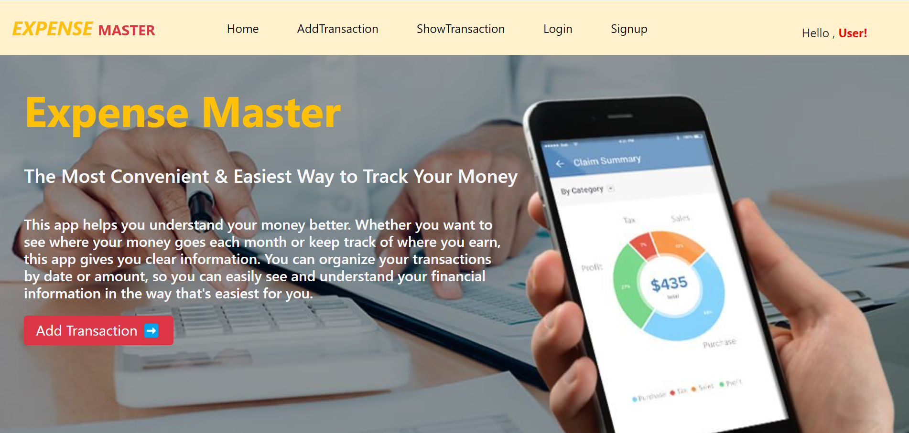

# Expense Master

#### 
Expense project is a web application that helps users manage their finances by allowing them to record, categorize, and analyze their expenses. 

Key features include user authentication, an intuitive interface for adding expenses, budgeting tools, visual reports, reminders, and data security measures.

 - I developed this project using **MERN stack**.
 
- I Implemented REST-Full APIs with
Express and Node.js to **store and retrieve
user specific expenses in MongoDB**.

- The perform a **CRUD** operations

- In this project designed to be **user-friendly**,
and focusing on **simplicity**.

- Only logged-in or the current user can add
and view their transactions.

### Source code:-
        https://github.com/achaltelmasre/expense-master

 ### Live Demo:-
        expense-master.onrender.com/
